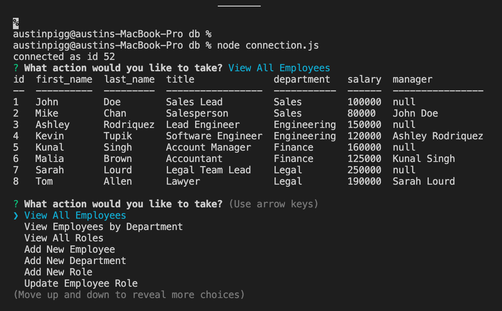

# 12-EMS

## Description

* This app allows users to document each of their employees. You can add new employees as well as create new departments and roles. It also allows you to remove employees.

* To run this app, open terminal to the folder and type "node connection.js"

## Link to Repository

* https://github.com/alp13097/12-EMS

## Screenshots

